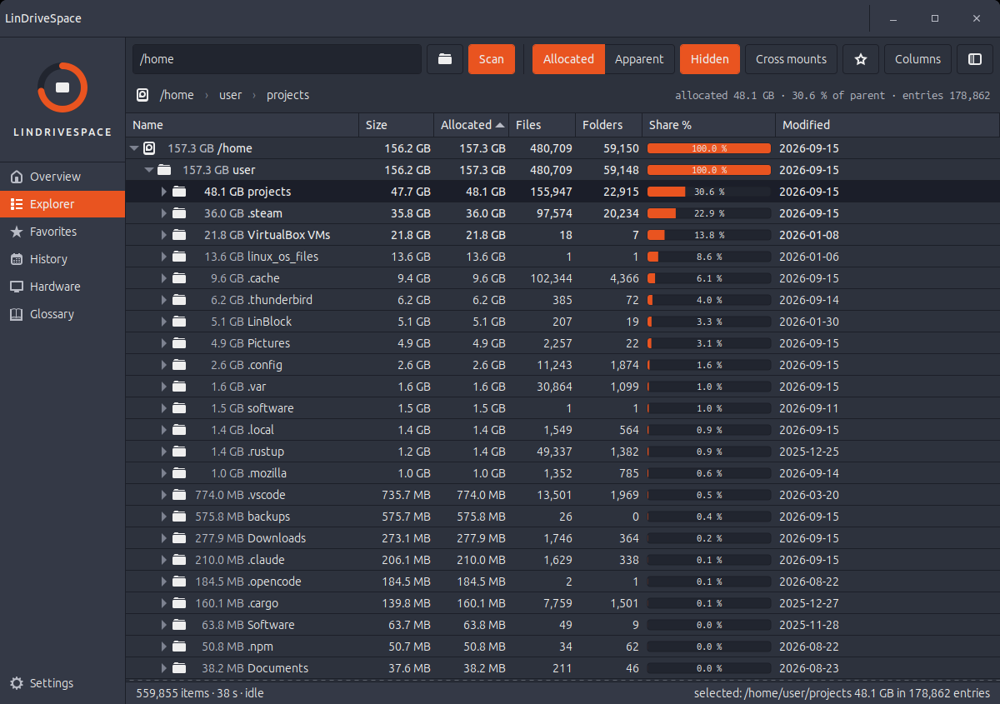
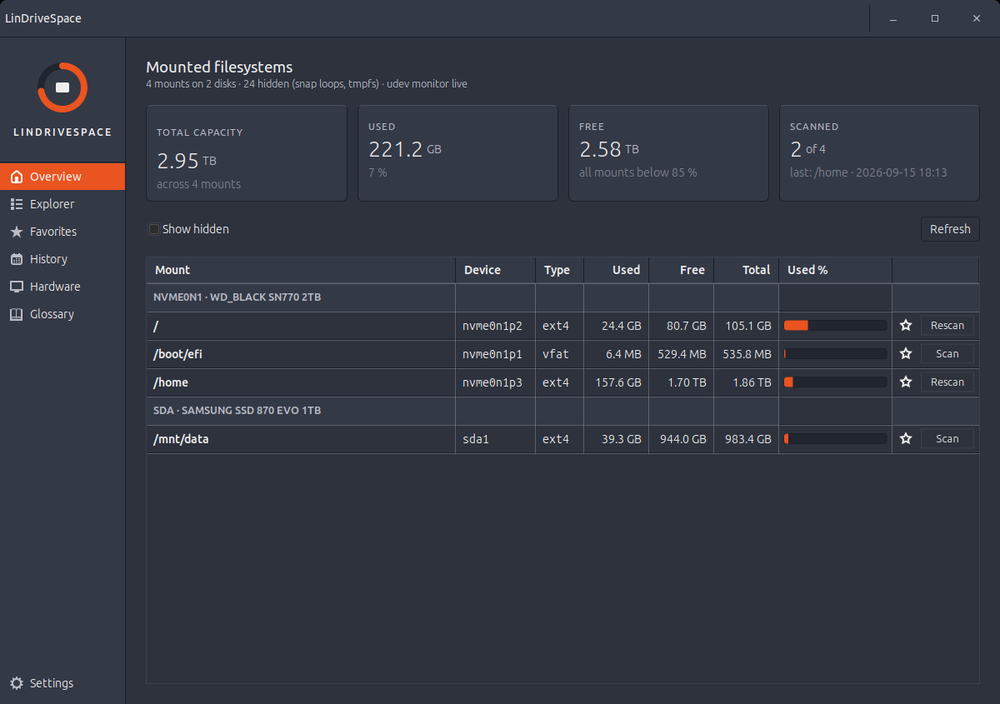
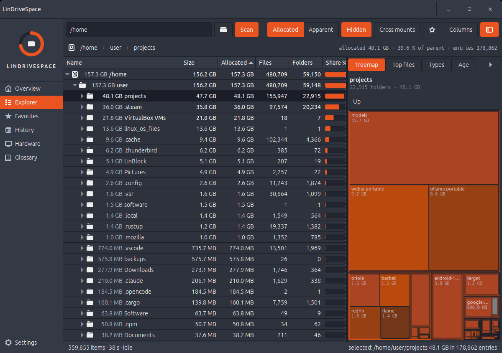
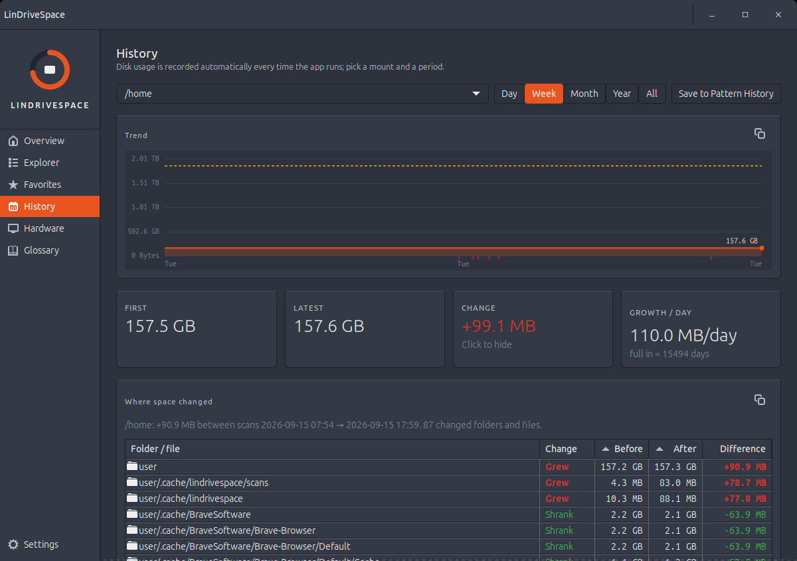
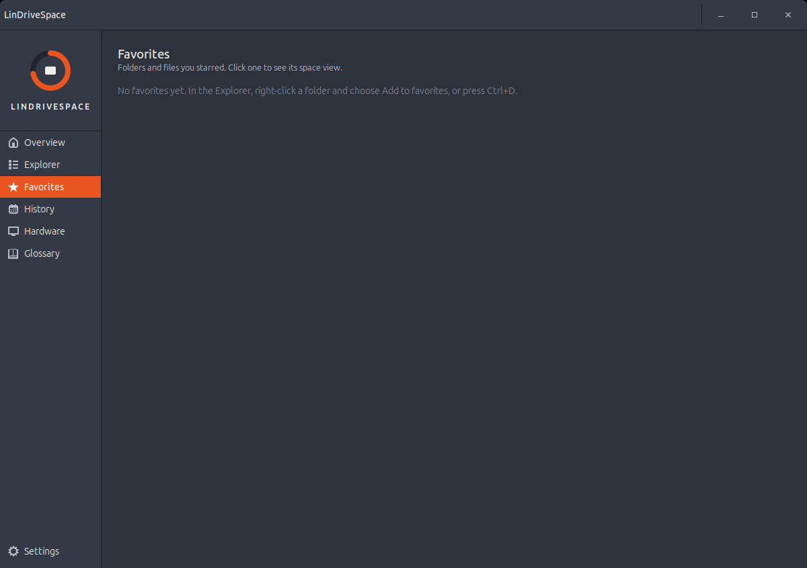
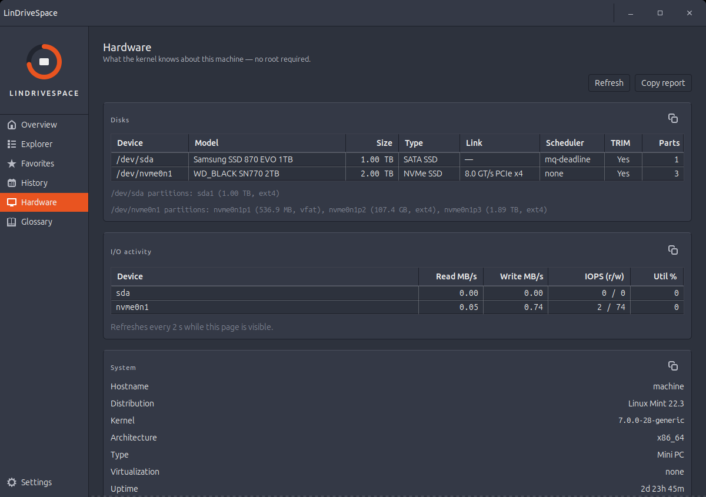
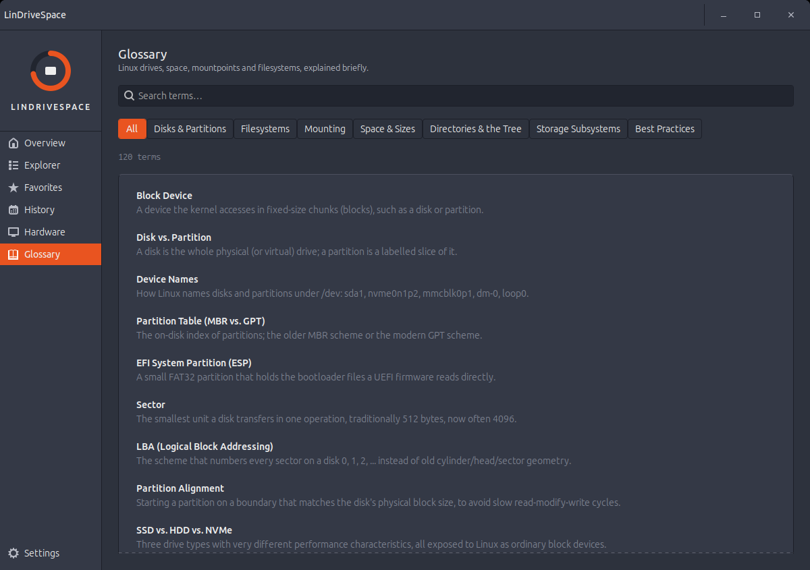
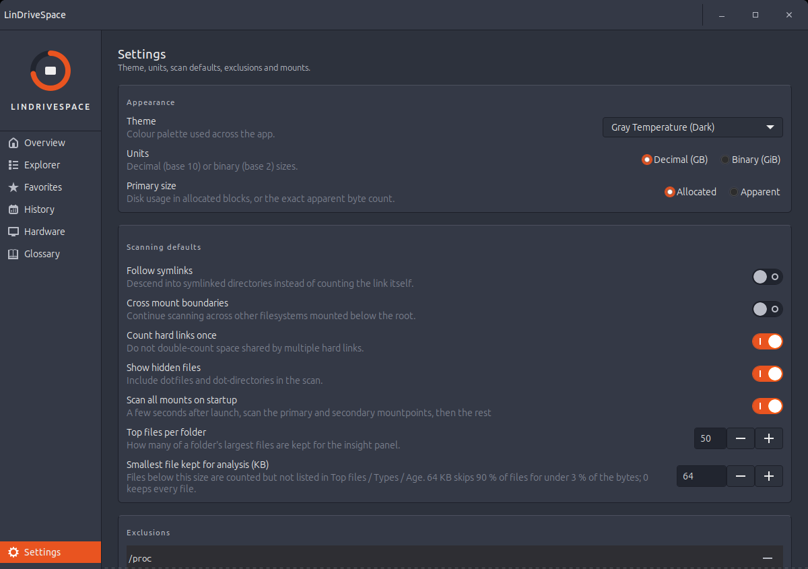

# LinDriveSpace

**A native GTK3 disk-space explorer for Linux Mint and Debian-family desktops.**
See every mount and partition at a glance, then drill into folders and files to find out exactly
what is eating your disk — TreeSize / WizTree style, with Linux-correct numbers.



> Status: **v0.1 — installable** (2026-09). Every screen below is built and packaged (`.deb`,
> installer script, menu entry); see [Install and run](#install-and-run) and the [Roadmap](#roadmap).

---

## Why LinDriveSpace

Linux has `du`, `ncdu`, `baobab` and GNOME Disks. None of them show, in one window, the three things
you actually need when a disk fills up:

1. **Which filesystem is full** — every mount with used / free and a usage ring, hot-plugged drives included.
2. **Where inside it the bytes went** — a sortable tree of folders with *apparent* and *allocated* size,
   file and folder counts, a percent-of-parent bar and the last-modified date.
3. **What to delete** — the largest files in any subtree, a treemap, file-type totals and an age histogram.

LinDriveSpace does all three in a single native GTK 3 application with no web runtime, styled with
Ubuntu's typeface and colour language.

## Features

### Overview — mounts and partitions
- **One list**: disks as section rows and one sortable row per mount with device, type, used, free, total, an inline used-% bar and a star; double-click to scan, right-click for Scan, Open, Favorite and primary/secondary. Columns can be reordered, resized and hidden.
- **Scans start by themselves.** A couple of seconds after launch every physical mount is queued (primary, secondary, `/`, then the rest). A scan strip at the top of the content area shows the running scan with a real progress bar (scanned of the mount's used space), the rate and an estimated countdown, plus Pause and Stop. Turn the auto-scan off under Settings › Scanning.
- Every mounted filesystem grouped by physical disk (NVMe, SATA, USB, loop), with label, device, filesystem type, used / free / total and a usage bar that turns amber at 85 % and red at 95 %.
- Mark a **primary** and a **secondary** mountpoint in Settings › Mounts: those rows are badged and listed first.
- KPI tiles: total capacity, used, free, and how many mounts have been scanned.
- Live hot-plug: USB drives appear and disappear as they are attached (udev monitor).
- Noise hidden by default: snap `squashfs` loops, `tmpfs`, `proc`, `sysfs`, Docker overlays. One chip reveals them.
- "Scan" on any row, or scan an arbitrary folder (file chooser, drag-and-drop, or `lindrivespace /path`).



### Explorer — folders and files
- Tree-table columns: **Name · Size · Allocated · Files · Folders · % of Parent · Modified** (Owner and Type optional).
- **Two sizes, always.** *Size* is apparent (`st_size`); *Allocated* is what actually occupies the disk
  (`st_blocks × 512`, what `du` reports). Allocated is the default sort and bar basis; one click switches.
- Hard links counted once; symlinks never followed; mount boundaries respected (crossing is opt-in).
- Progressive fill: the root row appears immediately and the tree fills as subtrees settle; scanning never blocks the UI.
- Largest-first sort, bold rows for the top children of each parent, inline Share % bars, breadcrumb strip, status bar.
- **Drill down to files.** Expanding a folder lists its files live (sizes from `lstat`), interleaved with sub-folders in the same sort order, each with its own Share % bar; very wide folders show the 2,000 largest plus a "… N more files" row so totals always add up. Double-click a file to reveal it in the file manager.
- Columns can be dragged into any order, resized, sorted from their header, and shown or hidden from the header menu or the toolbar's Columns button; the layout is remembered.
- Denied subtrees (other users' homes, `/var/lib/docker`) are marked with a lock and can be re-scanned as
  administrator through a polkit prompt — the elevated helper is a tiny stdlib-only process, never the GUI.
- Cancel, pause, rescan a subtree, exclude a folder.

*(Pictured at the top of this page.)*

### Insight panel (Analysis view, collapsible)
- **Treemap** (squarified) of the selected row; click to select, double-click to zoom.
- **Top files** inside the selection with path, size and modified date.
- **File types** grouped by class (video, image, archive, package cache, log, …).
- **Age** histogram: allocated bytes by last-modified bucket (7 d, 30 d, 90 d, 1 y, older).



### Actions and export
- Open in file manager, open terminal here, copy path, move to trash (with confirmation).
- Export the tree as CSV or JSON; export the treemap as PNG.
- Every finished scan is kept as a compact snapshot (newest 12 per mount) so History can show where space changed.

### History
- Disk usage is recorded automatically (every refresh, every finished scan, and by the optional background collector) and charted per mount for a Day, Week, Month, Year or All.
- First / Latest / Change / Growth-per-day tiles; click **Change** to see *where* it happened: a sortable table of folders and files (grew / shrank / new / deleted, before, after, difference) diffed between the newest scan and the oldest one in the period. Double-click a row to open it in the Explorer.
- Pattern History keeps named bookmarks of a mount + period view.
- Background collection: Settings › Background collection enables a systemd user timer that runs `lindrivespace --collect` (usage only, or with a full scan) hourly, every 6 h, daily or weekly, even when the app is closed.



### Favorites
- Star folders or files from the Explorer (toolbar star, Ctrl+D or the context menu); the Favorites page lists them and opens each one's space view in a click. A file favourite opens its folder with the file selected.



### Hardware
- What the kernel knows about the machine, no root required: system and chassis type, motherboard and firmware, CPU and memory, storage controllers, supported drive types, a disks table (link speed, block sizes, scheduler, TRIM, write cache) and live I/O rates.



### Glossary
- 120 short entries on Linux drives and space: disks and partitions, filesystems (what "ext" is, ext2/3/4, XFS, Btrfs, ZFS, vfat, squashfs, tmpfs, overlayfs), mounting, sizes and allocation, directories versus folders, storage subsystems and best practices, with search and category filters.



### Settings
- Theme: Gray-Temperature Dark (default); Light and System-follow planned for v1.1.
- Units: decimal GB (default) or binary GiB.
- Scan defaults, exclusion list, hidden-filesystem rules, primary / secondary mountpoints.



### Diagnostics
- Every uncaught error (main loop, worker threads, GTK callbacks) and every GTK warning is written to a rotating log under `~/.cache/lindrivespace/logs/` and shown in an in-window error bar with a details dialog.
- `lindrivespace --debug` prints verbose logging to the terminal; Settings › About shows the log location and opens the folder.

## Screens

All screenshots above are real captures of the application (1200 × 800, this machine's mounts,
after the startup scan) and live in `docs/screenshots/`. The approved design mockups they were
built from are in `docs/mockups/` (HTML plus PNG renders).

## Design language

| | |
|---|---|
| **Type** | Ubuntu (UI, tabular figures for numbers), Ubuntu Mono (paths, raw bytes, status bar) |
| **Surfaces** | `#495060` canvas · `#343946` surface · `#2d323d` tree body · `#21252f` wells · `#1b1e29` selection |
| **Accent** | Ubuntu orange `#e95420` (bars, active nav, rings), `#fd5c01` hover; aubergine `#772953` and warm grey `#aea79f` as secondary series |
| **Semantic** | green `#3fb950` free, amber `#f5a623` ≥ 85 %, red `#e0362c` ≥ 95 % / denied |
| **Metrics** | 150 px sidebar, 24 px tree rows, 12 × 96 px percent bars, 12 px usage bars, 4 px base unit |

The palette is sampled from the gray-temperature kit in
[universal-instruction-set/universal-themes](https://github.com/MensuraMedia/universal-instruction-set/tree/main/universal-themes/image-reference)
and squared with the Ubuntu brand colours.

## Architecture

```
src/lindrivespace/
├── app.py            Gtk.Application, CLI args, CSS install
├── config/           layout metrics · theme tokens (dataclass → tokens.css) · settings store
├── core/             PURE PYTHON — no GTK imports
│   ├── fsnode.py     __slots__ node: size, alloc, files, dirs, mtime, children
│   ├── scanner.py    iterative os.scandir walk, mount boundary, hard-link dedupe, cancel/pause
│   ├── events.py     DirStarted / DirDone / Progress / Finished / Error (queue contract)
│   ├── mounts.py     psutil + /proc/self/mountinfo + lsblk topology + udev monitor
│   ├── treemap.py    squarified layout · classify.py · snapshot.py · units.py
│   └── scanner_cli.py  stdlib-only NDJSON scanner used by the pkexec helper
├── models/           Gtk.TreeStore adapter (lazy children, model-owned sort) · mounts list store
├── services/         scan controller (thread → queue → GLib drain), actions, export, privilege
└── ui/               window, sidebar, pages (overview, explorer, favorites, snapshots=History, hardware, glossary, settings), widgets
```

- **Core purity.** `core/` imports nothing from GTK. It is unit-tested headless, runs as the root helper,
  and will back a future CLI. A test imports every core module with `gi` blocked.
- **Threading.** One scanner thread per scan; events flow one-way through `queue.SimpleQueue` and are
  drained on the GTK main loop in ≤ 8 ms slices, so scrolling stays smooth during a scan.
- **Tree performance.** Rows are appended lazily on expand, columns are fixed-size, the view runs in
  fixed-height mode, and sorting is owned by the model, not GTK.
- **Foundation.** Built on an optimized fork of
  [gtk-python-dashboard-starter](https://github.com/mikesdatawork/gtk-python-dashboard-starter):
  the 150 px sidebar, page stack and CSS-provider pattern are kept; the bare `Gtk.Window` becomes a
  `Gtk.Application`, seven hard-coded themes become one token-driven theme.

The full design is in [docs/CONCEPT-AND-TECHNICAL-DESIGN.md](docs/CONCEPT-AND-TECHNICAL-DESIGN.md).

## Requirements

- Linux Mint 22.x / Ubuntu 24.04 / Debian 12+ (any GTK 3.24 desktop)
- Python 3.10+ (3.12 on Mint 22)
- System packages: `python3-gi gir1.2-gtk-3.0 python3-cairo python3-psutil python3-pyudev fonts-ubuntu policykit-1`

## Install and run

**Debian package** (Linux Mint, Ubuntu, Debian) — installs the program, the `lindrivespace`
command, the menu entry (System › LinDriveSpace), icons, AppStream metadata and the polkit policy:

```bash
git clone https://github.com/MensuraMedia/lindrivespace.git && cd lindrivespace
scripts/build-deb.sh                       # → dist/lindrivespace_0.1.0_all.deb
sudo apt install ./dist/lindrivespace_0.1.0_all.deb
```

**Installer script** (no packaging tools; dependencies must be present):

```bash
sudo apt install python3-gi gir1.2-gtk-3.0 python3-cairo python3-psutil python3-pyudev fonts-ubuntu policykit-1
scripts/install.sh            # this user only: ~/.local (launcher, menu entry, icons)
scripts/install.sh --system   # all users: /usr/local (+ polkit helper), asks for sudo
scripts/uninstall.sh          # remove (same options); settings and history are kept
```

**From the checkout**, nothing to install:

```bash
./run.sh                 # or bin/lindrivespace — system Python + system PyGObject
./run.sh /mnt/data       # open straight into a scan of a folder
```

The launcher accepts the same options everywhere: a folder to scan, `--debug`, `--smoke`,
`--screenshot out.png`, and `--collect [--scan]` for the headless background collector.

## Development

```bash
python3 -m venv --system-site-packages .venv && .venv/bin/pip install ruff mypy pytest
.venv/bin/ruff check src tests && .venv/bin/ruff format --check src tests
.venv/bin/mypy --strict src/lindrivespace/core
.venv/bin/python -m pytest -q tests/core                       # headless
DISPLAY=:0 .venv/bin/python -m pytest -q tests/ui tests/models # needs a display (or broadwayd)
python3 -m lindrivespace --smoke                               # builds the window and exits
python3 -m lindrivespace --screenshot /tmp/lds.png             # renders the window to PNG
python3 -m lindrivespace --debug                               # verbose logging on stderr
```

The project is governed by the
[universal-instruction-set](https://github.com/MensuraMedia/universal-instruction-set) (v2026.04):
`.claude/` holds the rules, hooks, commands, agents and memory; `changelog.md` records every change;
architectural decisions live in `.claude/memory/decisions.md`.

## Roadmap

| Milestone | Scope | Status |
|---|---|---|
| M0 | Governance, scaffold, themed window with sidebar | in progress |
| M1 | Core scanner + units + tests + bench | planned |
| M2 | Mount discovery + Overview page | planned |
| M3 | Explorer tree-table, progressive fill, sort, context menu | planned |
| M4 | Insight panel: treemap, top files, types, age | planned |
| M5 | Actions, export, history + change drill-down | done |
| M6 | Scan as administrator, settings, light tokens, a11y pass | planned |
| M7 | `.deb` package, desktop entry, AppStream, v1.0.0 | planned |

v1.1: light theme CSS, Flatpak, bind-mount detection via mountinfo, multi-threaded scanning.

## Non-goals (v1)

Not a file manager (no move / copy / rename), no background daemon, no remote or SSH filesystems.

## Credits

- Foundation: [mikesdatawork/gtk-python-dashboard-starter](https://github.com/mikesdatawork/gtk-python-dashboard-starter)
- Standards and theme references: [MensuraMedia/universal-instruction-set](https://github.com/MensuraMedia/universal-instruction-set)
- Ubuntu font family by Dalton Maag / Canonical

## License

Free for personal and educational use (inherits the starter's terms until a licence file is added).
